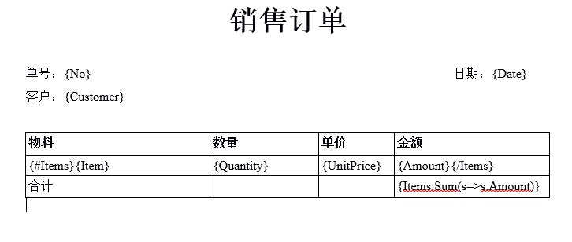

# Word模板

### 什么是Word模板？

通过Word模板，用户可以上传自定义的Word模板文件， 文件里可设置处理指令，如占位符，循环输出等， 最终根据这些指令可导出用户需要的最终word文件。

### 如何使用？

1， 打开Word模板管理界面进行维护，这个界面存在于Core项目中，界面名称：SearchSys_WordTemplate， 在维护模板的时候关联一个实体类型。

2， 打开对应实体类型的管理界面或明细界面， 点击Word模板按钮进行word文件导出。

### Word模板指令

#### 表达式：{exp}，
exp：要求是合格的BPL语言表达式， 表达式的上下文是实体类型， 如，Word模板关联到订单实体类型，则：
{No}可以访问到订单的单号
{Date.ToString("yyyy/MM/dd")}可以访问 订单的日期，按照yyyy/MM/dd格式
{Items.Count()}可以访问到订单数

注意：
如果希望直接输出{exp}文本而不要当作指令进行处理，可以使用{{exp}}，这样在处理的时候会自动当作{exp}进行输出

#### 循环输出：{#exp}，{/exp}

#### 段落循环输出
其中{#exp}表示循环开始，{/exp}表示循环结束， 如Word模板关联到订单类型，则：
{#订单项集合}
商品：{Item}
数量：{Quantity}
单价：{UnitPrice}
金额：{Amount}
{/订单项集合}

以上可以循环输出订单项集合， 每一条订单项输出商品，数量，单价，金额信息， 循环开始和结束之间的表达式上下文可以访问到当前循环的项

#### 表格行循环输出
{#exp}放在数据表格行第一个单元格的开头，{/exp}放在数据表格行最后一个单元格的结束，可以对数据表格行进行循环输出

